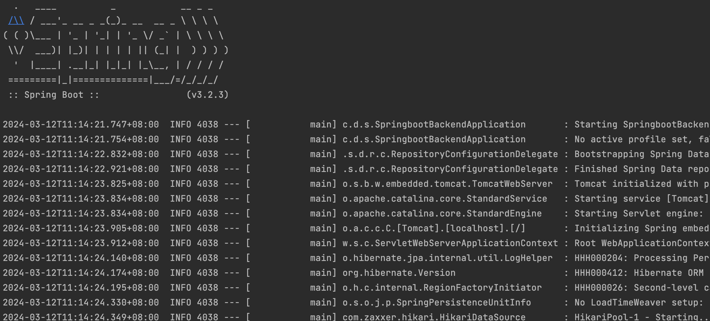
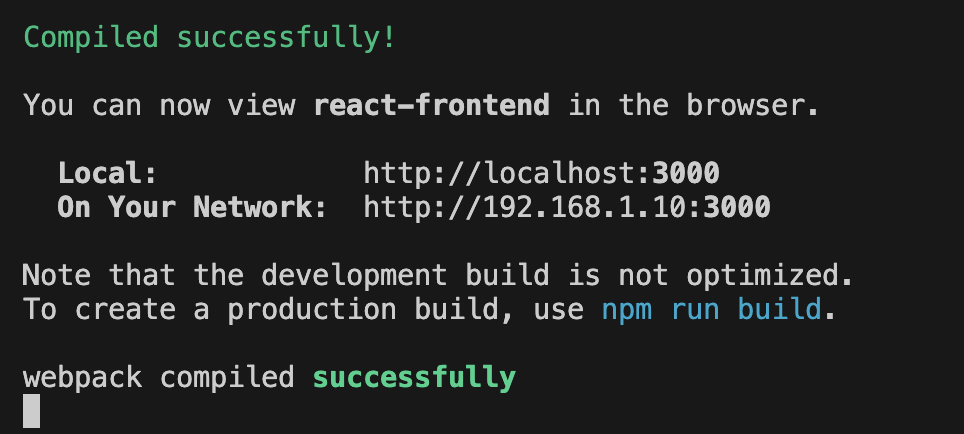

# dxc-login-app

## Set up guide
### Database 
1. Create a mysql database named `dxc_login` locally

### Backend services
1. Open up Intellij or any IDE of your choice, locate the file `SpringbootBackendApplication.java` under `springboot-backend/src/main/java/com/dxc/springbootbackend/`
2. Right-click and run the file
3. You should see this in your terminal once the application has successfully been run

4. Populate your mysql database with the file `test.sql` under `dxc-login-app/springboot-backend/sql/test.sql`

### Frontend application
1. Install node
2. Open a new terminal in VSC (if you encounter npm command not found errors, try closing and reopening VSC)
3. Navigate to the react-frontend folder
4. Run the `npm install` command
4. Run the `npm run start` command
5. You should see this in your terminal and a new browser tab will open showing the login page
